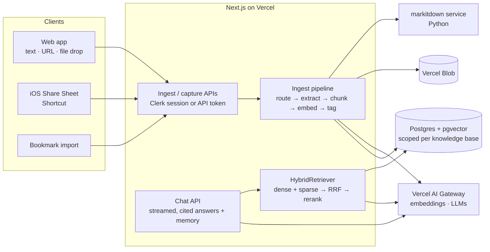
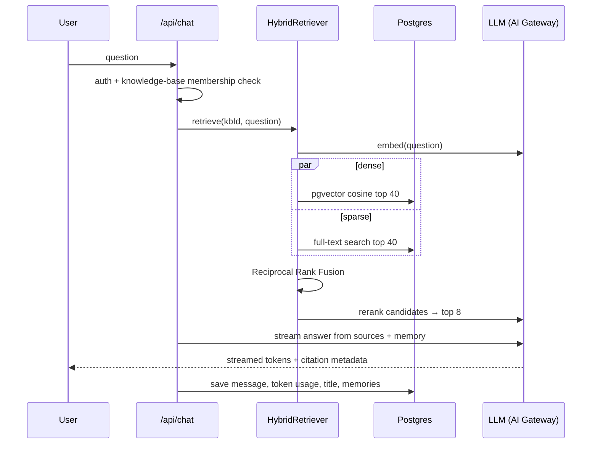

# GoldenRetriever 🐕

[](https://github.com/kamlau024/GoldenRetriever/actions/workflows/ci.yml)
[](LICENSE)

**Save anything from the web, then ask questions of your own library and get answers grounded in what you saved, with citations.**

**[▶ Live demo](https://goldenretriever-web.vercel.app)**: sign up for a free account to try it.

GoldenRetriever is a personal knowledge base with retrieval-augmented chat. You capture articles, PDFs, notes and bookmarks from the web app or your phone's Share Sheet. GoldenRetriever parses, chunks, embeds and auto-tags each item. When you ask a question, a hybrid search finds the most relevant passages and the model streams an answer that cites them. Click a citation to see the passage it came from.

<!-- TODO: add a screenshot or GIF of the chat with citation popovers, e.g.
 -->

<!-- TODO: Why I built this — 2–3 sentences in your own words. -->

---

## Features

- **Capture from anywhere**
  - Paste text, submit a URL (the server fetches and parses it), or drag and drop PDF/Office/image files.
  - **iOS Share Sheet** capture through an Apple Shortcut and a token-authenticated capture API ([setup guide](docs/ios-shortcut.md)).
  - **Bookmark import** from a browser's exported HTML file. It shows progress for each item and a specific reason for each failure (unreachable, blocked, 404, rate-limited, …).
- **Ingestion pipeline:** detects the format, extracts the content (Mozilla Readability for HTML, [markitdown](https://github.com/microsoft/markitdown) for binary documents), chunks it, embeds it and tags it with an LLM.
- **Hybrid retrieval:** pgvector semantic search and Postgres full-text search are merged with Reciprocal Rank Fusion, then reordered by an LLM reranker.
- **Grounded chat:** answers stream back with inline citation chips and popovers that show the source snippet. If nothing relevant is found, the model declines to answer rather than guess.
- **Conversation memory:** you can opt in to having it extract facts about you and recall relevant past conversations. Facts can be viewed and deleted in Settings.
- **Chat history:** conversations are saved, titled automatically, and can be renamed.
- **Library:** a card layout with filtering by tag, search, and delete.
- **API tokens** for non-browser clients, plus a responsive, mobile-friendly UI with light and dark themes.

## Tech stack

| Layer | Choice |
|---|---|
| Monorepo | Turborepo + pnpm workspaces, TypeScript throughout |
| Web app | Next.js 15 (App Router), React 19, Tailwind CSS v4, shadcn/ui |
| Auth | Clerk (browser sessions) + hashed API tokens (clients) |
| Database | Postgres 17 + **pgvector** (Neon in production), Drizzle ORM |
| AI | Vercel AI SDK via **Vercel AI Gateway**; models chosen by environment variable |
| Storage | Vercel Blob (uploaded files) |
| Document conversion | Python serverless function wrapping Microsoft markitdown |
| Testing | Vitest (node + jsdom), Testing Library, real Postgres in Docker |
| Hosting | Vercel |

## Architecture



### How a question is answered



## Engineering highlights

- **Hybrid search with rank fusion.** Vector search is good at meaning; keyword search is good at exact names, codes and rare terms. [`HybridRetriever`](packages/retrieval/src/hybrid.ts) runs both and merges them with [Reciprocal Rank Fusion](packages/retrieval/src/rrf.ts). RRF scores each result by its rank in each list, so the two incompatible score scales (cosine distance and `ts_rank`) never have to be normalised against each other.
- **Robust LLM reranking.** AI Gateway has no native rerank endpoint, so a small model returns passage numbers in relevance order. The [parser](packages/ai/src/rerank.ts) drops duplicate and out-of-range numbers and appends any passages the model left out, so a malformed reply still yields a complete, stable ordering.
- **Multi-tenant data model.** Every document, chunk and conversation belongs to a `knowledge_base`, and every route checks the caller's membership. Today each user has one personal base, but the schema already supports shared bases. Tests cover the IDOR cases (accessing another user's data).
- **SSRF protection.** Because the server fetches URLs that users submit, [`url-safety.ts`](packages/ingest/src/url-safety.ts) resolves DNS and rejects private, loopback, link-local (including the cloud metadata IP), CGNAT and IPv4-mapped IPv6 addresses before fetching.
- **Pluggable boundaries.** `AiClient`, `Converter`, `BlobStore` and `Retriever` are interfaces with in-memory or deterministic mock implementations. The whole test suite runs without Clerk, Blob, markitdown or any paid AI API.
- **Spec → plan → test-driven development.** Each feature began as a design spec and an implementation plan (see [`docs/superpowers/`](docs/superpowers/)) and was built test-first. The suite has about 230 tests across 70+ files, including database integration tests against real Postgres + pgvector.

## Repository layout

```
apps/web/            Next.js app — UI, API routes, auth, services
packages/
  config/            zod-validated environment + model selection
  core/              shared domain types
  db/                Drizzle schema, migrations, knowledge-base-scoped queries
  ingest/            format router, Readability extraction, chunker, URL safety, pipeline
  ai/                AiClient (embed / tag / answer / rerank / memory / titles) + mock
  retrieval/         Retriever interface, HybridRetriever, RRF
services/convert/    markitdown Python function (deployed separately)
docs/                iOS Shortcut guide, design specs and implementation plans
```

## Getting started

**Prerequisites:** Node 22+, pnpm 9, Docker.

```bash
pnpm install
pnpm test        # starts Postgres+pgvector in Docker, applies migrations, runs all tests
```

Scope a test run by passing arguments through to Vitest:

```bash
pnpm test packages/retrieval     # one package
pnpm test -t "IDOR"              # by test name
```

### Run the app locally

1. Create a free [Clerk](https://clerk.com) development instance and an [AI Gateway](https://vercel.com/ai-gateway) key, then create `apps/web/.env.local`:

   ```bash
   NEXT_PUBLIC_CLERK_PUBLISHABLE_KEY=pk_test_...
   CLERK_SECRET_KEY=sk_test_...
   DATABASE_URL=postgres://gr:gr@localhost:5433/gr_test
   AI_GATEWAY_API_KEY=...
   ```

2. Start the database, apply migrations, and run the dev server:

   ```bash
   pnpm db:up
   for f in packages/db/drizzle/*.sql; do
     docker compose -f docker-compose.test.yml exec -T db psql -U gr -d gr_test < "$f"
   done
   pnpm --filter @gr/web dev
   ```

3. Sign up, add some content from the Library, and ask about it in Chat.

File uploads also need `BLOB_READ_WRITE_TOKEN`, `MARKITDOWN_URL` and `MARKITDOWN_SECRET` (see [`services/convert`](services/convert/README.md)). Text and URL capture work without them.

### Configuration

| Variable | Purpose | Default |
|---|---|---|
| `DATABASE_URL` | Postgres with pgvector | — |
| `AI_GATEWAY_API_KEY` | AI Gateway key (on Vercel, OIDC is used instead) | — |
| `GR_GENERATION_MODEL` | Chat answers | `anthropic/claude-sonnet-4-6` |
| `GR_TAGGING_MODEL` | Auto-tagging, titles | `anthropic/claude-haiku-4-5` |
| `GR_EMBEDDING_MODEL` | Embeddings (1536-d) | `openai/text-embedding-3-small` |
| `GR_RERANK_MODEL` | LLM reranker | `openai/gpt-4o-mini` |
| `BLOB_READ_WRITE_TOKEN`, `MARKITDOWN_URL`, `MARKITDOWN_SECRET` | File uploads + conversion | — |
| `WORKER_SECRET`, `APP_URL` | Background ingestion worker | — |

Models are plain `provider/model` strings, so you can switch providers without changing code.

## Roadmap

- Chrome extension (MV3) to capture pages that require login, using the rendered DOM
- Durable background ingestion with Vercel Queues (currently runs in-process with `after()`)
- Pin resolved IPs for URL fetches to close the DNS-rebinding (TOCTOU) gap
- Playwright end-to-end smoke test
- Shared knowledge bases (the schema and Clerk Organizations already allow for them)
- Android PWA share target; document refresh and RSS subscriptions

## License

[MIT](LICENSE) © 2026 Kam Lau
