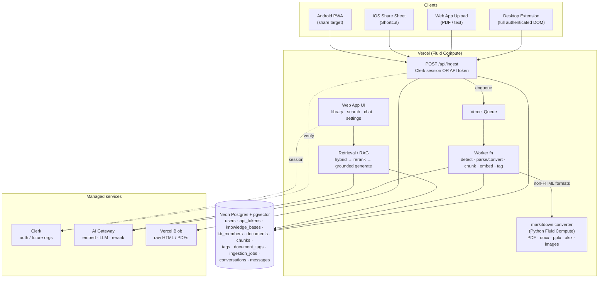
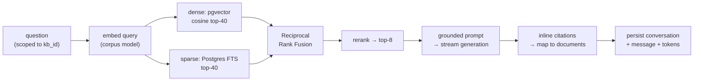

# GoldenRetriever — Prototype Architecture & Technical Design

- **Date:** 2026-06-14
- **Status:** Approved design (pre-implementation)
- **Scope of this prototype:** Stage 0 — the solo "save the web, ask your library" core loop, built on a clean, multi-tenant-ready foundation that grows into Stages 1–4 without a rewrite.
- **Source product docs:** Product Brief, Product Roadmap, Competitive Landscape, Validation Plan, Task Backlog, Partner One-Pager (Obsidian vault).

---

## 1. Goals & non-goals

### In scope (Stage 0 core loop)
- **Clip → Ingest → Organize → Ask** for a single user over their personal knowledge base.
- Browser extension (Chrome MV3) that captures the **authenticated rendered DOM** of a page.
- **Mobile capture** from iOS via the Share Sheet (iOS Shortcut → ingest API); Android via PWA share target.
- Client-agnostic, token-authenticated **ingest API** shared by all clients.
- Async **ingestion pipeline**: detect format → parse/convert → chunk → embed → lightweight LLM auto-tagging → store.
- **Multi-format document ingestion**: URLs or uploads pointing to non-HTML documents (PDF, Word/PowerPoint/Excel, images) are converted to markdown via **markitdown** (Microsoft) running as a Python Fluid Compute service; HTML uses Readability, plain text passes through.
- **Hybrid retrieval** (dense pgvector + sparse Postgres FTS) → rerank → **grounded RAG Q&A with citations**.
- Import flow (bookmarks / Pocket / Readwise export) — bulk URL ingestion through the same pipeline.
- Web app: library view, search, chat, settings (API tokens).
- **Configurable model provider** (Claude / OpenAI / Gemini) via Vercel AI Gateway.

### Out of scope (deferred, but seams designed in)
- **Stage 1** collaboration: shared bases, per-contributor attribution UI, @GoldenRetriever chatroom.
- **Stage 2** auto-taxonomy knowledge graph (LazyGraphRAG) + research-report generation.
- **Stage 3** **document updates & automatic refresh (manual re-ingest, per-document polling, RSS/Atom/sitemap feed subscriptions)**, spaced resurfacing, MCP endpoint, native mobile apps, video/podcast transcription.
- **Stage 4** Team/Enterprise: SSO/SAML/SCIM, SOC 2, RBAC, admin console, audit logs.

> **Decision (2026-06-14):** Document refresh + RSS/feed auto-ingestion is **deferred to Stage 3** to keep the prototype lean. The `documents` table retains reserved `updated_at` / `update_count` columns as a forward seam (default null / 0; populated from Stage 3), but no refresh pipeline, polling, conditional-fetch fields, feed subscriptions, or cron scheduler are built now.

> **Decision (2026-06-14):** Multi-format document ingestion via **markitdown** is **included in Stage 0** — it's core to "save the web, ask your library" (people save PDFs and docs constantly). It is implemented as a `Converter` abstraction in the ingestion pipeline plus a Python markitdown service on Vercel Fluid Compute. Audio/video transcription (also a markitdown capability) stays **out of scope** until Stage 3.

### Design principles
- **Multi-tenant from day one** — every record is scoped to a `knowledge_base`; solo users simply have one personal KB. This is the seam that makes Stage 1 a drop-in, not a rewrite.
- **Meter what costs money** — track generation tokens per answer; storage is cheap, generation is the COGS (per the economics review in the product docs).
- **Defer the cost-runaway** — no knowledge graph in the prototype; it sits behind a `Retriever` interface for Stage 2, and will use LazyGraphRAG/on-demand, gated to paid tiers.
- **Isolated, testable units** — one-way dependency direction; pure logic (chunking, fusion, hashing) is unit-tested; AI calls are mocked at a single boundary.

---

## 2. Recommended stack

| Concern | Choice | Rationale |
|---|---|---|
| Monorepo | Turborepo + pnpm | One repo for web app, extension, shared packages |
| Web app | Next.js (App Router) on Vercel | SSR UI + co-located API routes; Fluid Compute |
| Browser extension | Chrome MV3 via **WXT** | Modern DX; captures authenticated rendered DOM |
| Auth | **Clerk** (Vercel Marketplace) | Best Next.js DX; **Organizations** primitive = Stage-1 shared-base seam |
| DB + vectors | **Neon Postgres + pgvector** (Marketplace) | One store: app data, chunks, embeddings, FTS |
| ORM / migrations | Drizzle | Type-safe, serverless-friendly, clean migrations |
| AI calls | Vercel AI SDK → **AI Gateway** | One key, provider fallback, observability, `provider/model` strings |
| Generation (default) | `anthropic/claude-sonnet-4-6` | Strong grounded, citation-faithful answers |
| Tagging (default) | `anthropic/claude-haiku-4-5` | Cheap classification |
| Embeddings (default) | `openai/text-embedding-3-small` (1536-d) | Cheap, strong; pairs with pgvector |
| Rerank (default) | `cohere/rerank-3.5` | Table-stakes retrieval quality; swappable |
| Object storage | Vercel Blob | Raw HTML snapshots + uploaded PDFs |
| Async ingestion | **Vercel Queues** + DB job rows | Durable parse→chunk→embed off the request path |
| Doc conversion | **markitdown** (Python, Fluid Compute) | PDF / Office / images → markdown; HTML uses Readability, text passes through |

---

## 3. System architecture



---

## 4. Clients & capture modes

All clients call **one** client-agnostic, token-authenticated ingest endpoint. Capture modes differ in source and quality characteristics:

| Capture mode | Source | Quality | Notes |
|---|---|---|---|
| `full_dom` | Desktop extension | **Best** | Sends authenticated rendered DOM → handles paywalls/JS-heavy SPAs the server can't reach |
| `selection` | Extension / mobile share of selected text | High | Ingests the exact text the user highlighted |
| `url_fetch` | Mobile share / paste of a bare URL | **Mixed** | Server-side fetch + parse. Degraded for paywalled/JS HTML (no auth session); **good** for URLs that point directly at a document (PDF/Office/image) — those are downloaded and converted via markitdown |
| `upload` | Web app file upload (PDF / Office / image) | Good | Converted to markdown server-side via markitdown |

**Authentication:**
- Web app + extension UI → **Clerk session**.
- Headless clients (extension background worker, iOS Shortcut) → **personal API token** (`api_tokens`, per-user, named, revocable), copied from Settings.

**Mobile specifics:**
- **iOS:** Safari does *not* support the PWA Web Share Target API, so a PWA cannot register as an iOS share target. The prototype uses an **iOS Shortcut** placed in the Share Sheet that `POST`s `{url, text?}` + API token to `/api/ingest`. Zero native-app code; one tap from any app. The productized Stage-3 version is a native iOS Share Extension on the same API.
- **Android:** PWA **Web Share Target** is supported — the installable web app registers as a share target via the manifest.

---

## 5. Ingestion pipeline (async, durable)

Chosen approach: **async via Vercel Queues + worker function**, with the job logic written behind a small interface so it can fall back to a DB-job-table + cron drainer if the Queues beta is problematic. Both share the same `ingestion_jobs` table and worker code.

Flow:
1. `POST /api/ingest` authenticates (Clerk session or API token), resolves the target KB, writes a `documents` row (`status='pending'`), stores the raw payload (HTML / document bytes / text) to Blob, enqueues a job, returns immediately with the document id.
2. Worker drains the queue:
   - **Detect format**: from the HTTP `Content-Type`, file extension, or magic bytes → choose a converter.
   - **Parse / convert** (behind a `Converter` interface):
     - `text/html` → main content via Mozilla Readability → markdown (turndown).
     - `application/pdf`, Office (`docx`/`pptx`/`xlsx`), `image/*`, and other binary formats → **markitdown** Python service → markdown (images via OCR; optional LLM image description through the configured generation model).
     - `text/plain` / selection text → used directly.
   - **Chunk**: recursive/semantic chunking (~500–1000 tokens, with overlap), preserving ordinal order.
   - **Embed**: embed each chunk via the configured embedding model; store `embedding` + `embedding_model`.
   - **Tag**: lightweight LLM auto-tagging/classification (NOT a graph) → `tags` / `document_tags`.
   - **Finalize**: set `status='ready'`, `word_count`, `lang`; mark job finished.
3. UI shows per-document status (`pending`/`processing`/`ready`/`failed`) with retry on failure.

Failure handling: jobs are retryable with bounded `attempts` and `last_error`; a document stuck `failed` is surfaced in the library with a retry action.

---

## 6. Retrieval / RAG pipeline

Behind a `Retriever` strategy interface so a graph retriever can be added at Stage 2 without disturbing the core loop:



The interface:

```
interface Retriever { retrieve(kbId, query): RankedChunk[] }
  ├─ HybridRetriever   (pgvector + Postgres FTS + RRF + rerank)   ← Stage 0, now
  └─ GraphRetriever    (LazyGraphRAG / on-demand, gated to paid)  ← Stage 2 seam
```

Guardrails:
- **Honest grounding**: if no chunk clears a relevance threshold, answer "I don't have anything saved about that" rather than hallucinate. This trust primitive underpins the credibility of the future shared graph.
- **Token accounting**: per-message token tally is the metering seam for tier economics.

---

## 7. AI / model configuration (provider-agnostic)

All model calls route through **Vercel AI Gateway** using `provider/model` strings, configured by env vars in `packages/ai`:

| Env var | Default | Swap examples |
|---|---|---|
| `GR_GENERATION_MODEL` | `anthropic/claude-sonnet-4-6` | `openai/gpt-5`, `google/gemini-2.5-pro` |
| `GR_TAGGING_MODEL` | `anthropic/claude-haiku-4-5` | `openai/gpt-5-mini`, `google/gemini-2.5-flash` |
| `GR_EMBEDDING_MODEL` | `openai/text-embedding-3-small` | any **1536-dim** model |
| `GR_RERANK_MODEL` | `cohere/rerank-3.5` | swappable |

**Constraint:** generation, tagging, and rerank are freely swappable at runtime (stateless). **Embeddings are not** — pgvector columns are fixed-dimension and embedding spaces are incompatible across models. Therefore: pin the vector column to 1536 dims; store `embedding_model` on every chunk; treat an embedding-model change as an explicit re-embed migration (only models sharing 1536 dims are hot-swappable; a different dimension requires a column/migration).

---

## 8. Data model

Postgres (Neon) + pgvector. Every content row is scoped to a `knowledge_base`.

```
users           id (= Clerk user id), email, name, image_url, created_at
api_tokens      id, user_id, name, token_hash, last_used_at, revoked_at, created_at
knowledge_bases id, owner_id, name, kind('personal'|'shared'), created_at
kb_members      kb_id, user_id, role('owner'|'editor'|'viewer')        -- Stage-1 seam (solo: owner only)
documents       id, kb_id, added_by, source_url, title,
                kind('web'|'pdf'|'document'|'image'|'text'), mime_type,
                capture_mode('full_dom'|'selection'|'url_fetch'|'upload'),
                status('pending'|'processing'|'ready'|'failed'),
                blob_key, lang, word_count,
                captured_at, created_at,
                updated_at, update_count,        -- reserved Stage-3 seam (null / 0 for now)
                metadata jsonb
chunks          id, document_id, kb_id, ordinal, content, token_count,
                embedding vector(1536), embedding_model, fts tsvector
tags            id, kb_id, name, slug
document_tags   document_id, tag_id, confidence
ingestion_jobs  id, document_id, type('ingest'), status, attempts,
                last_error, enqueued_at, finished_at
conversations   id, kb_id, user_id, title, created_at
messages        id, conversation_id, role('user'|'assistant'), content,
                citations jsonb, tokens, created_at
```

**Field notes**
- `documents.updated_at` / `documents.update_count` — **reserved forward-seam columns**, populated starting Stage 3 (document refresh). Null / 0 in the prototype.
- `documents.added_by` — populated now (= owner in solo) so Stage-1 attribution badges are free.
- `kb_members` — present but trivial in solo; the seam for shared bases + roles.
- `ingestion_jobs.type` — only `'ingest'` in Stage 0; `'refresh'` / `'feed-check'` types are added at Stage 3.
- `documents.mime_type` — the detected source MIME type; drives converter routing (Readability vs markitdown vs passthrough). `kind` is the coarse category.

**Indexes**
- `chunks`: HNSW on `embedding` (`vector_cosine_ops`); GIN on `fts`.
- `documents`: `(kb_id, status)`, `(kb_id, created_at)`.

**Tenant isolation:** every query filters by `kb_id`, with access checked via `kb_members`. Postgres RLS is deferred to Stage 4 (hard isolation); app-layer scoping is enforced in the `db` package query helpers for the prototype.

---

## 9. Infrastructure & services map (Vercel-centric)

| Service | Provider | Provisioned via | Purpose |
|---|---|---|---|
| Hosting / compute | Vercel (Fluid Compute) | Vercel project | Next.js web app + API + worker |
| Database + vectors | Neon Postgres + pgvector | Vercel Marketplace | All app data + embeddings + FTS |
| Auth | Clerk | Vercel Marketplace | Users, sessions, future orgs |
| AI models | Vercel AI Gateway | Vercel | Embeddings, generation, tagging, rerank |
| Object storage | Vercel Blob | Vercel | Raw HTML snapshots, uploaded PDFs |
| Queue | Vercel Queues | Vercel | Durable ingestion jobs |
| Doc conversion | markitdown (Python) | Vercel Fluid Compute (separate function) | Convert PDF/Office/images → markdown |
| Browser extension dist | Chrome Web Store | manual | Distribution of the WXT extension |
| Mobile capture | iOS Shortcut / Android PWA | user setup | Share-to-GoldenRetriever |

> Vercel Cron is **not** used in Stage 0; it is introduced at Stage 3 to drive document refresh and feed checks.

Environment configuration via `vercel env` + a shared zod schema in `packages/config`.

---

## 10. Repo structure

```
goldenretriever/
├─ apps/
│  ├─ web/                      Next.js App Router — UI + API
│  │  └─ app/api/{ingest,search,chat,documents,tokens,worker,webhooks}
│  └─ extension/                WXT Chrome MV3 — clip + capture authed DOM
├─ packages/
│  ├─ core/        domain types, KB/document/job logic
│  ├─ db/          Drizzle schema, migrations, scoped query helpers
│  ├─ ingest/      format router, Converter iface, parse (Readability→md), chunk
│  ├─ ai/          model config + embed/generate/rerank via Gateway
│  ├─ retrieval/   Retriever interface + HybridRetriever (Graph seam)
│  └─ config/      shared zod env schema, tsconfig, eslint presets
├─ services/
│  └─ convert/     markitdown Python function (Vercel Fluid Compute)
├─ docs/superpowers/specs/      design docs (this file)
├─ vercel.ts                    project config
├─ turbo.json
└─ package.json                 pnpm workspaces
```

Dependency direction is one-way: `core`/`db` → `ingest`/`ai`/`retrieval` → apps. Apps never get imported by packages.

---

## 11. Cost model (COGS awareness)

| Item | Cost characteristic | Control |
|---|---|---|
| Storage (rows, vectors, Blob) | pennies | none needed at prototype scale |
| Embeddings | ~$0.02 / 1M tokens | embed once on ingest |
| Generation | the real COGS | per-message `tokens` tally → tier metering seam |
| Rerank | small per query | isolated behind `ai` package |
| Doc conversion (markitdown) | mostly CPU (cheap); OCR / LLM image description cost only when used | basic PDF/Office conversion is local CPU; gate LLM image description |
| Knowledge graph | **deferred** | behind `Retriever` interface; LazyGraphRAG + paid-gated when added |

---

## 12. Security, privacy & legal guardrails

- **User-initiated personal capture** model (not server-side mass scraping) — the lower-risk posture flagged in the Validation Plan (R2).
- **Delete / takedown** is a first-class operation: deleting a document cascades to its chunks and removes its Blob snapshot. This is the mechanism for DMCA/takedown response.
- **API tokens** are stored hashed (`token_hash`), named, and revocable.
- **Tenant scoping** enforced in `db` query helpers; RLS deferred to Stage 4.
- Raw snapshots are private (Vercel Blob private storage); served only to the owning user.

---

## 13. Testing strategy

- **Unit (TDD):** chunking, RRF fusion, citation mapping, Readability extraction on fixture HTML, and the "no relevant context → honest refusal" guardrail. Pure and deterministic.
- **Integration:** ingestion worker against a disposable Postgres+pgvector (Neon branch) — clip fixture → `ready` → chunks exist; retrieval returns the expected doc.
- **Contract:** ingest-API auth (Clerk session vs. API token) and capture-mode handling.
- **AI boundary:** model calls mocked at the `ai` package; a small **golden-question eval set** against a seeded corpus guards retrieval quality (run manually / lightweight CI).

---

## 14. Forward seams (roadmap alignment)

| Stage | What unlocks it | Already in the foundation |
|---|---|---|
| **1 — Collaboration** | invites + realtime chatroom + @GoldenRetriever bot | `kb_members`, `documents.added_by`, kb-scoped queries, Clerk Orgs |
| **2 — Graph + reports** | `GraphRetriever` (LazyGraphRAG, gated) + report workflow | `Retriever` interface, kb-scoped chunks, Vercel Workflow available |
| **3 — Live + MCP** | document refresh + RSS/feed subscriptions (adds `content_hash`, conditional-fetch fields, `watch_enabled`, `feed_subscriptions`, Vercel Cron, `refresh`/`feed-check` job types, chunk-replacement); MCP server wrapping retrieval; native iOS share extension | reserved `updated_at`/`update_count` columns; `retrieval` is a clean package boundary; one ingest API |
| **4 — Enterprise** | SSO/SCIM, RBAC, audit logs, hard isolation | Clerk Orgs, role on `kb_members`, RLS-ready schema |

---

## 15. Risks carried from research

- **Ingestion fragility (permanent maintenance tax):** mitigated by client-side authenticated DOM capture; mobile URL-fetch is explicitly degraded; multi-format conversion is isolated in the markitdown Python service (formats break differently — budget ongoing parser/converter upkeep); large/scanned files and OCR add latency/cost.
- **Copyright/ToS exposure:** user-initiated personal capture + first-class delete/takedown + private snapshots.
- **Cost-runaway (GraphRAG/generation):** graph deferred + gated; token metering seam.
- **Cold-start "blank brain":** import flow (bookmarks/Pocket/Readwise) seeds the corpus quickly. (Feed-driven seeding arrives with refresh/RSS at Stage 3.)

---

## 16. Open decisions / deferred questions

- Embedding model is pinned at 1536 dims for the prototype; revisit if a higher-quality model with different dims is desired (requires re-embed migration).
- Queue vs. DB-job-table: default to Vercel Queues; the worker interface allows falling back to a cron-drained `ingestion_jobs` table if the beta is problematic.
- Reranker provider (Cohere default) to be confirmed once AI Gateway model availability is verified during setup.
- Document conversion uses **markitdown** (Python, Fluid Compute) for PDF/Office/images; HTML stays on Node Readability. Image OCR is built in; LLM-based image description is optional and, when enabled, routes through the configured generation model (a metered cost — off by default).
- markitdown runs as a **separate Vercel function** (isolated Python runtime) called by the worker over HTTP via `MARKITDOWN_URL`; the Node pipeline talks to it behind a `Converter` interface (mocked in tests).
- Document refresh + RSS/feeds deferred to Stage 3 (decision 2026-06-14) to reduce prototype complexity.
