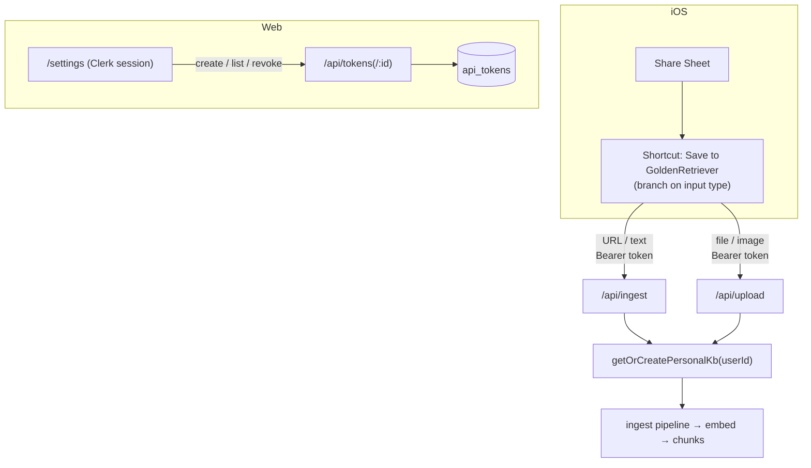

# iOS Share Sheet Capture — Design

**Date:** 2026-06-27
**Status:** Approved (design)
**Depends on:** Stage A (ingest/search/chat) and Stage B (binary upload) — both deployed.

## Overview

Let a user capture content into GoldenRetriever from their iPhone's Share Sheet:
share a Safari page (URL), selected text, or a file/image (PDF, screenshot, photo)
to a "Save to GoldenRetriever" iOS Shortcut, which POSTs to the existing ingest
APIs authenticated with a personal **API token**.

The backend already has the auth primitives: `api_tokens` (with `name`,
`lastUsedAt`, `revokedAt`), `verifyApiToken` (updates last-used, honors
revocation), `getOrCreatePersonalKb`, and `resolveAuth` already accepts
`Authorization: Bearer <token>`. What's missing is (1) a way to mint/manage
tokens, (2) making `kbId` optional so the Shortcut carries only a token, and
(3) the Shortcut recipe itself.

## Goals

- Self-serve **token management** UI: create (shown once), list, revoke.
- The iOS Shortcut needs **only a token + base URL** — no KB id to configure.
- Capture **URLs, text, and files/images** from the Share Sheet.
- No new infrastructure; reuse the deployed ingest/upload pipeline.

## Non-goals

- No importable `.shortcut` binary (Apple's signed format can't be generated
  here) — the Shortcut is delivered as a step-by-step recipe.
- No multi-KB selection in the Shortcut (defaults to the personal KB).
- No OAuth / "Sign in with Apple" inside the Shortcut — bearer token only.

## Architecture

## Components

### 1. Token management API — `apps/web/app/api/tokens/route.ts` + `[id]/route.ts`

- `POST /api/tokens` — body `{ name }`. Generate `grt_` + 256-bit random
  (base64url), store only `sha256(raw)` as `tokenHash`, insert with `name` +
  `userId`. Respond `{ id, name, token }` where `token` is the raw secret,
  returned **once**.
- `GET /api/tokens` — list the caller's tokens: `{ id, name, createdAt,
  lastUsedAt, revoked }`. Never returns the raw secret or the hash.
- `DELETE /api/tokens/:id` — set `revokedAt = now()`. 404 if the token isn't
  the caller's (no information leak about others' token ids).

**Privilege-escalation guard (critical):** these three endpoints authenticate
with a **Clerk web session only**, never a bearer token. A new
`resolveSessionUser(req)` helper returns the Clerk user or `null` and is used
here instead of `resolveAuth`. Rationale: a captured capture-token must not be
able to mint more tokens or revoke others.

### 2. Token queries — `apps/web/lib/tokens.ts`

`createApiToken(db, userId, name) → { id, token }`, `listApiTokens(db, userId)`,
`revokeApiToken(db, userId, id) → boolean`. Token generation + `hashToken`
(reused from `lib/auth.ts`) live server-side only.

### 3. Settings page — `apps/web/app/settings/page.tsx` + `components/api-tokens.tsx`

- Server page is Clerk-protected (middleware already gates non-public routes).
- Client component:
  - **Create**: name field → `POST /api/tokens` → render the raw token once in a
    copy box with "you won't see this again."
  - **List**: name, created, last-used, and a **Revoke** button (`DELETE`).
  - **iOS setup**: shows the base URL, the freshly-created token, and a link to
    the Shortcut recipe.
- A "Settings" link is added to the app header/nav.

### 4. Default to personal KB — `app/api/ingest/route.ts`, `app/api/upload/route.ts`

`kbId` becomes optional. When omitted:
`const kbId = body.kbId ?? (await getOrCreatePersonalKb(db, principal.userId))`.
When provided, the existing membership/authorization check is unchanged. This
is the change that lets the Shortcut carry only a token.

### 5. The iOS Shortcut — `docs/ios-shortcut.md` (and summarized in Settings)

"Save to GoldenRetriever" accepts Share Sheet input (URLs, Text, Images, PDFs,
Files):

1. Receive input; accept the types above.
2. Store the token + base URL as Shortcut text fields (set once).
3. **If** the input is a URL → `Get Contents of URL`: `POST {base}/api/ingest`,
   header `Authorization: Bearer <token>`, JSON body `{ "url": <input> }`.
4. **Else if** the input is Text → `POST {base}/api/ingest`, JSON body
   `{ "text": <input> }`.
5. **Else** (file/image) → `POST {base}/api/upload` as `Form` with a `file`
   field set to the shared file.
6. Show a notification: "Saved to GoldenRetriever ✓" on 2xx, else the error.

## Data flow & error handling

- Capture request → `resolveAuth` (bearer) → principal → personal KB → existing
  pipeline. Failures surface as the route's existing JSON errors; the Shortcut
  reports non-2xx in its notification.
- Token endpoints → `resolveSessionUser` → 401 JSON if no Clerk session.
- Revoked tokens are rejected immediately by `verifyApiToken` (existing
  `isNull(revokedAt)` filter).

## Security

- Raw token shown once; only the SHA-256 hash is stored (existing pattern).
- Token format `grt_` + 256 bits of CSPRNG entropy (base64url) — unguessable.
- Token-management endpoints are session-only (no token-auth) — prevents a
  leaked token from escalating.
- Revoke is immediate; `DELETE` is scoped to the caller's own tokens (IDOR-safe).
- No raw token or hash ever returned by `GET`.

## Testing (TDD)

- **Token queries** (`lib/tokens.test.ts`, integration DB): create stores a hash
  (not the raw) + returns the raw once; list omits secret/hash and reflects
  revocation; revoke sets `revokedAt`; `verifyApiToken` rejects a revoked token.
- **Token routes**: `POST` rejects bearer-token auth (escalation guard) and
  succeeds for a session; `GET` returns only the caller's tokens; `DELETE`
  another user's token → 404 (IDOR).
- **Ingest/upload**: `kbId` omitted → content lands in the caller's personal KB;
  provided `kbId` still enforces membership.
- **Component** (`api-tokens.test.tsx`, jsdom): renders the list, the create
  flow reveals the token once, Revoke calls `DELETE`.
- All wired into `scripts/test.sh` (node + component sweeps already covered).

## Out of scope / follow-ups

- Async processing via Vercel Queues (currently in-process).
- Custom domain for a nicer base URL in the Shortcut.
- Per-token scopes (e.g., capture-only vs. read) — single capability for now.
