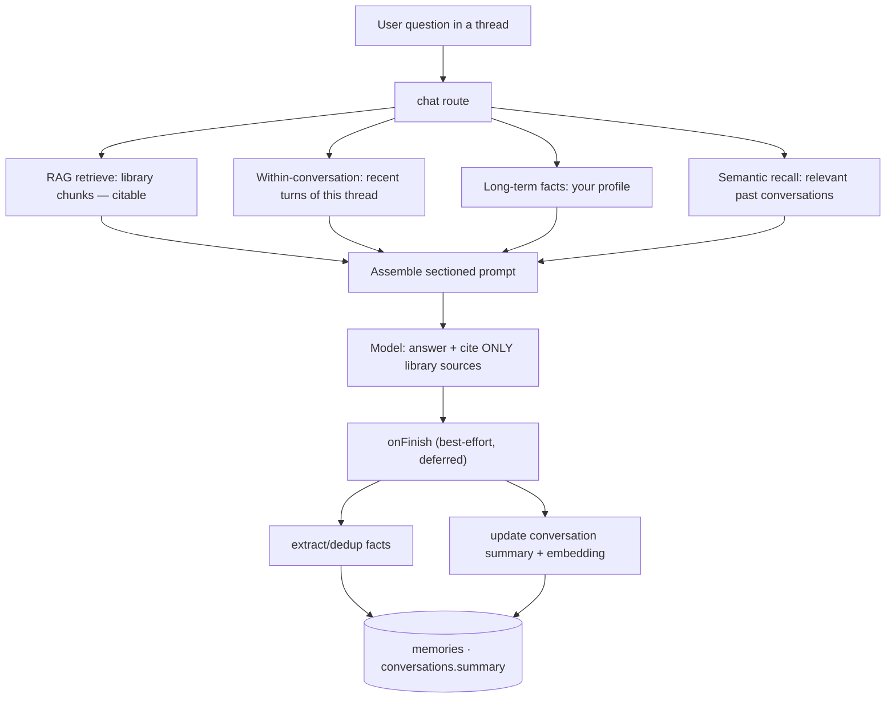

# Conversational Memory — Design

**Date:** 2026-07-01
**Status:** Approved (design). Ready for implementation planning (one plan per phase).

## Goal

Give GoldenRetriever memory across turns and across conversations, without weakening its citation
integrity. Two capabilities the user asked for:

1. **Within-conversation memory** — the model sees the earlier turns of the active thread, so
   follow-ups ("what about the second one?") resolve.
2. **Across-conversation long-term memory** — durable **extracted facts** about the user (an editable
   profile) **and** **semantic recall** of relevant past conversations.

The user has **full management** of long-term memory: view, edit, and delete individual facts, a global
on/off toggle, and "clear all."

## Non-negotiable constraint: citation integrity

Today's prompt (`groundedPrompt`) is strict: *"answer using ONLY the numbered sources; if the sources
don't contain the answer, say REFUSAL."* Memory (facts, prior turns, recalled chats) is **context that
informs an answer but is never a citable source.** The design keeps the library-grounded citation rule
and the REFUSAL behavior exactly as they are, and adds memory as clearly-delimited, non-citable prompt
sections.

## Architecture



### Sectioned prompt (new prompt builder)

A new prompt builder composes only the sections that have content and fit the budget:

```
About you (memory):            <- extracted facts, if memory enabled & present
Earlier in this conversation:  <- recent turns of the active thread
Possibly relevant past chats:  <- recalled past-conversation summaries (Phase 3)

Sources:                       <- numbered library chunks [1], [2], … (citable)

Instruction: Answer the question. Cite factual claims about saved content with [n] from the
numbered Sources only. Use the memory and conversation context to personalize and to resolve
references, but never cite it. If the Sources do not contain the answer, say "<REFUSAL>".

Question: …
```

The REFUSAL string and citation format are unchanged from `chat-service.ts`. Each section is
token-budgeted (below) so the prompt stays bounded.

## Data model

New / changed tables (Drizzle + Postgres/pgvector). Embeddings reuse the existing 1536-dim embedding
model (the `chunks.embedding` column is pinned to 1536; memory embeddings use the same width).

- **`memories`** (new) — long-term extracted facts, scoped to the **user** (memory is about the person,
  not a KB):
  - `id text pk`
  - `user_id text not null → users.id (on delete cascade)`
  - `content text not null` — the distilled fact/preference
  - `kind text not null` — `'fact' | 'preference'`
  - `source_conversation_id text null → conversations.id (on delete set null)` — provenance; nulled if
    the seeding conversation is deleted (the distilled fact is retained)
  - `embedding vector(1536) null` — for dedup and (future) fact-level recall
  - `created_at`, `updated_at timestamptz`
- **`users.memory_enabled boolean not null default true`** (new column) — the global toggle.
- **`conversations.summary text null`** and **`conversations.summary_embedding vector(1536) null`** (new
  columns, Phase 3) — one summary+embedding per conversation, for semantic recall. Deleting a
  conversation removes the row (and thus its summary), so recall never surfaces deleted chats.

No change to `messages` (within-conversation memory reads existing rows).

## Phase 1 — Within-conversation memory *(small, near-term)*

- The chat route loads the recent messages of `convId` (reuse `getMessages`) and passes them to the new
  prompt builder as the "Earlier in this conversation" section.
- **Budget:** most recent messages up to a token budget (target ~1,500 tokens, roughly the last 8
  turns). Older turns are dropped in Phase 1; a running-summary refinement is deferred (see Open items).
- No schema change; no new endpoints. This alone delivers follow-up continuity.
- The existing IDOR check (Task 3 of chat-history) already guarantees the caller owns `convId`, so
  loading its turns is safe.

## Phase 2 — Extracted facts + Memory settings

**Extraction (in the chat route's `onFinish`, best-effort, deferred like titling):**
- If `memory_enabled` for the user, a cheap **tagging-class model** reads the latest exchange (the user
  message + assistant reply, plus a small window) and proposes **0–3** durable facts/preferences as
  short strings. Transient chit-chat yields none.
- **Dedup:** embed each candidate; if cosine similarity to an existing memory exceeds a threshold
  (~0.9), skip (or update `updated_at`); otherwise embed + insert with `source_conversation_id`.
- Best-effort: any failure is swallowed (matches the ingest pipeline's tagging convention) and must
  never affect the streamed reply. Bounded cost: one cheap extraction per exchange.

**Injection:** the "About you" section lists the user's facts (cap ~20 facts / ~800 tokens), only when
`memory_enabled`.

**Memory settings — `Settings → Memory` page** (base-ui):
- **Enable memory** toggle (`users.memory_enabled`).
- List of facts (content + relative time + source conversation link); **inline edit**; **delete** each;
  **Clear all memory**.
- Endpoints (session-auth via `resolveAuth`, userId-scoped, **404-no-leak** like `/api/conversations`):
  - `GET /api/memories` → the caller's facts
  - `PATCH /api/memories/[id]` → edit content (re-embed)
  - `DELETE /api/memories/[id]` → delete one
  - `DELETE /api/memories` → clear all (also clears conversation summaries/embeddings so recall has
    nothing)
  - `PATCH /api/settings` → set `memory_enabled`
- Toggle **off** ⇒ no extraction, no injection (data retained until cleared).

## Phase 3 — Semantic recall of past chats

- In `onFinish`, generate/update the conversation's `summary` + `summary_embedding` (cheap model +
  existing embedder) once the thread has ≥1 exchange.
- At query time, embed the user's question and cosine-search `conversations.summary_embedding` where
  `user_id = caller AND id <> currentConvId AND summary is not null`; take the top ~3 and inject their
  summaries into "Possibly relevant past chats."
- Excludes the current thread (that's Phase 1's job) and, implicitly, deleted conversations (their rows
  are gone).

## Privacy & security

- Everything is **userId-scoped**; all `/api/memories` + settings endpoints are ownership-gated and
  return **404** on a non-owned id (no existence leak), mirroring `/api/conversations`.
- Stored memory is **distilled** (facts, not raw chat) and recall is over **summaries** (not raw
  messages), limiting verbatim exposure.
- **Deleting a conversation** removes its messages (existing cascade) and its summary/embedding, and
  nulls `source_conversation_id` on any facts it seeded (facts retained, provenance detached).
- **Clear all memory** deletes all `memories` rows and clears conversation summaries/embeddings.
- **Toggle off** disables extraction and injection globally.

## Testing strategy

- **Unit:** the sectioned prompt builder (each section present/absent by toggle + content, budget
  truncation, REFUSAL/citation text preserved); fact-extraction parsing; dedup threshold logic; recall
  ranking/exclusions.
- **Integration (pgvector DB):** `memories` CRUD + ownership (userId-scoped, 404 no-leak); extraction
  inserts new + dedups near-duplicates; `memory_enabled=false` ⇒ no injection and no extraction; recall
  query excludes the current + deleted conversations; deleting a conversation nulls fact provenance and
  drops its summary.
- **Component (jsdom):** Memory settings page — list, inline edit, delete, clear-all, toggle.
- **Continuity check (Phase 1):** a follow-up that only resolves if prior turns are in the prompt.

## File structure (touch-points; the per-phase plans pin exact files)

| Phase | Area | Files |
|-------|------|-------|
| 1 | Prompt builder + chat route | `apps/web/lib/chat-service.ts` (new sectioned builder + budget helper), `apps/web/app/api/chat/route.ts`, `packages/db` (reuse `getMessages`) |
| 2 | Data + extraction | `packages/db/src/schema.ts` (+`memories`, `users.memory_enabled`) + migration, `packages/db/src/queries.ts` (memories CRUD, dedup query), `packages/ai/src` (`extractMemories`), chat route `onFinish` |
| 2 | Memory UI | `apps/web/app/api/memories/route.ts` + `[id]/route.ts`, `apps/web/app/api/settings/route.ts`, `apps/web/app/(app)/settings/…` Memory section, a `MemoryList` component |
| 3 | Recall | `packages/db/src/schema.ts` (+conversation `summary`,`summary_embedding`) + migration, `packages/ai/src` (`summarizeConversation`), `packages/db` recall query, chat route injection |

## Global constraints (inherited)

- Ownership userId-scoped; non-owned → **404**, never leak existence (mirrors `/api/conversations`,
  `/api/documents`).
- Embeddings are **1536-dim** (the pinned column width); reuse `GR_EMBEDDING_MODEL`.
- Extraction/summarization use the **cheap tagging model** (`GR_TAGGING_MODEL`), never the generation
  model; all memory writes are **best-effort** and must never break or delay the streamed reply.
- The prompt keeps the existing **citation format `[n]` and REFUSAL** rule for library sources; memory
  is never citable.
- UI on **base-ui** (`render={<X/>}` props), Tailwind v4 tokens, `cn` from `@/lib/utils`.
- Migrations: add a Drizzle migration SQL under `packages/db/drizzle/` (the test runner applies
  `packages/db/drizzle/*.sql` to the pgvector test DB).
- No new heavyweight dependencies.

## Open items (deferred refinements — not blocking)

- **Long within-conversation threads:** Phase 1 truncates to a token budget; a running-summary of older
  turns is a later refinement.
- **Extraction cadence/cost:** per-exchange extraction with dedup is the baseline; batching or
  end-of-conversation extraction can be tuned later if cost warrants.
- **Fact-level recall:** `memories.embedding` also enables retrieving relevant facts (not just injecting
  all) if the profile grows large — a future optimization.
