# Bookmark Import Design (Import tab → bulk URL ingest)

**Status:** Approved pending user review
**Date:** 2026-07-04

Let a user bulk-import URLs from their browser bookmarks into their personal library by uploading their browser's exported bookmarks file. Surfaced as a new **Import** tab in the "Add to your library" card. Reuses the existing URL ingest pipeline.

## Background: how a web app can access bookmarks

A web page has **no API to read the browser's bookmarks** — `chrome.bookmarks` exists only inside a browser *extension*. The two viable channels are:

1. **Exported bookmarks file (chosen for Phase 1).** Every major browser (Chrome, Edge, Safari, Firefox, Brave, Arc, Opera, Vivaldi) exports bookmarks to the **Netscape Bookmark File Format** — an `.html` file with nested `<DL><DT><A HREF="…" ADD_DATE=…>Title</A>` entries and `<H3>` folder headings. One parser covers every browser, needs no install, and drops into the existing ingest path.
2. **Browser extension (Phase 2, out of scope here).** A WebExtension with the `bookmarks` permission gives one-click import, but is per-browser and needs store distribution.

## Architecture

Three units, each independently testable:

### 1. `parseBookmarksHtml(html)` — pure parser (`packages/ingest/src/bookmarks.ts`, exported from `@gr/ingest`)

```ts
export interface BookmarkEntry { url: string; title: string; folder: string; }
export const MAX_BOOKMARK_IMPORT = 50;
export function parseBookmarksHtml(html: string): BookmarkEntry[];
```

- No DOM dependency (regex/token walk) so it runs both in the browser and in node tests.
- Walks the format in document order, maintaining a folder stack: `<H3>name</H3>` sets the name for the next `<DL>`; entering `<DL>` pushes it, leaving `</DL>` pops it; top-level entries get folder `"Bookmarks"`.
- Each `<A HREF>` becomes `{ url, title (its text, entity-decoded; falls back to the URL), folder (nearest enclosing) }`.
- Keeps only `http(s)` URLs (drops `javascript:`, `place:`, `mailto:`, `chrome://`, `file:`…); de-dupes repeated URLs within the file (first wins).
- HTML entities in titles/urls are decoded (`&amp; &lt; &gt; &quot; &#39; &#xNN;`); nested tags in titles are stripped.

`MAX_BOOKMARK_IMPORT` is the single source of the per-import cap, imported by both the client and the route.

### 2. Import tab UI (`apps/web/components/bookmark-import.tsx`, wired into `add-content.tsx`)

- `add-content.tsx` gains a 4th tab **Import** rendering `<BookmarkImport kbId={kbId} />`.
- Flow: `<input type="file" accept=".html,.htm">` → read the file's text **in-browser** → `parseBookmarksHtml` → state.
- Preview: "Found N bookmarks in M folders", grouped into **collapsible folder sections** (collapsed by default — a folder file can hold thousands, so we don't render every row up front). Each folder shows its name + count + a folder-level checkbox; expanding reveals per-item checkboxes. A global **Select all**. All items selected by default.
- A running **selected count vs. cap (`MAX_BOOKMARK_IMPORT` = 50)**. The Import button is disabled when `selected === 0` or `selected > 50`, with helper text "Select up to 50 pages per import."
- Import → `POST /api/import/bookmarks` with the selected `{ url, title }[]` → on success toast ("Importing N pages — they'll appear as they finish"), reset the picker, `router.refresh()`.

### 3. Bulk endpoint `POST /api/import/bookmarks` (`apps/web/app/api/import/bookmarks/route.ts`)

Body: `{ kbId?: string; items: { url: string; title?: string }[] }`. Mirrors `ingest/route.ts`:

- `resolveAuth` → 401 if unauthenticated.
- `items` must be a non-empty array → 400 otherwise; `items.length > MAX_BOOKMARK_IMPORT` → 400 (client caps too; server enforces).
- `kbId` defaults to the caller's personal KB; membership must be `owner`/`editor` → 403 otherwise (IDOR guard, identical to `/api/ingest`).
- For each item, **re-validate the URL server-side with `isSafeHttpUrl`** (never trust the client — SSRF guard); unsafe/invalid URLs are skipped and counted.
- Each safe item → `enqueueIngestion(db, { kbId, addedBy, captureMode: "url_fetch", kind: "web", mimeType: null, sourceUrl: url, title, rawContent: "" })`, then trigger processing the same way single-URL ingest does (prod: fire-and-forget `POST /api/worker` per job with `x-worker-secret`; local/dev: in-process `processJob`).
- Responds `202 { queued, skipped }`.

Imported documents land in the Library with the existing "processing → ready" status pills; `router.refresh()` surfaces them.

## Data flow

```mermaid
flowchart LR
    A[Browser: Export bookmarks .html] --> B[Import tab file picker]
    B --> C["parseBookmarksHtml() in-browser"]
    C --> D[Preview: collapsible folders + checkboxes, cap 50]
    D --> E["POST /api/import/bookmarks {items}"]
    E --> F[authz owner/editor + isSafeHttpUrl per URL]
    F --> G["enqueueIngestion → documents + ingestionJobs(queued)"]
    G --> H["/api/worker drains: fetch, convert, chunk, embed"]
    H --> I[Library: processing → ready]
```



## Security

- The uploaded file is parsed for `href`/text only and **never rendered**, so no XSS from file contents.
- The server re-runs `isSafeHttpUrl` (SSRF) and the cap on the submitted URLs — the client is untrusted.
- Authz (KB `owner`/`editor`) matches `/api/ingest`; bulk enqueue cannot target a KB the caller isn't in.

## Testing

- **Unit (`packages/ingest`):** `parseBookmarksHtml` over a realistic Netscape fixture — nested folders, top-level items, duplicate URLs (de-duped), a `javascript:`/`mailto:` link (dropped), entity-encoded titles (`&amp;`), and title falling back to the URL when empty. Assert entries, folders, ordering, http-only, dedupe.
- **Integration (`apps/web/test`):** `POST /api/import/bookmarks` — 401 (no auth), 403 (KB the caller isn't a member of), 400 (empty items; > 50 items), an unsafe URL is skipped while safe ones enqueue, and N safe items create N `documents` + N `ingestionJobs` rows. Reuses the ingest-route test harness (`__setIngestDeps` mock; `APP_URL` unset → in-process).
- **Component (jsdom):** `bookmark-import.tsx` — uploading a small fixture renders the folder/count preview; select-all + a per-folder toggle work; selecting > 50 disables Import with the helper text; Import POSTs the selected `{url,title}` array.

## Out of scope (Phase 1)

- The **browser extension** for one-click import (Phase 2).
- **De-duping against pages already in the library** (re-import creates a new document) — backlog.
- A **resilient queue drain** — the existing fire-and-forget per-job worker trigger is reused; Vercel Queues is the noted future hardening (already flagged in `ingest/route.ts`).
- Persisting the bookmark **folder** as a tag (folder is preview-only here).
- Mobile export ergonomics (exporting bookmarks on mobile is browser-dependent; desktop export is the target).

## Global constraints

- base-ui primitives via `render={<X/>}` props (never Radix `asChild`); reuse `tabs.tsx`, `card.tsx`, `button.tsx`, `input.tsx`. The preview uses **native `<input type="checkbox">`** styled with Tailwind (`accent-*`) — no new primitive — so rows stay testable via `getByRole("checkbox")`.
- Ownership/SSRF checks live server-side, mirroring `ingest/route.ts` (`isSafeHttpUrl`, KB membership `owner`/`editor`).
- `MAX_BOOKMARK_IMPORT = 50` defined once in `@gr/ingest`, imported by client and server.
- Tailwind v4 utility classes; `cn` from `@/lib/utils`; `@/` alias → `apps/web`.
